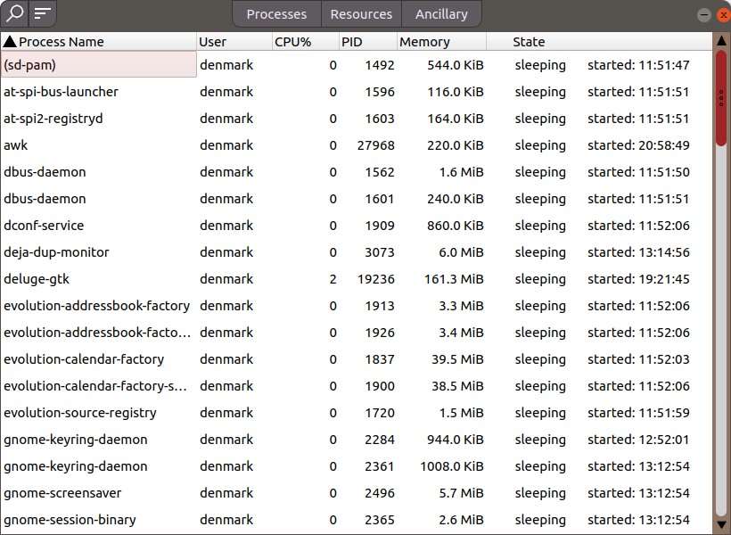
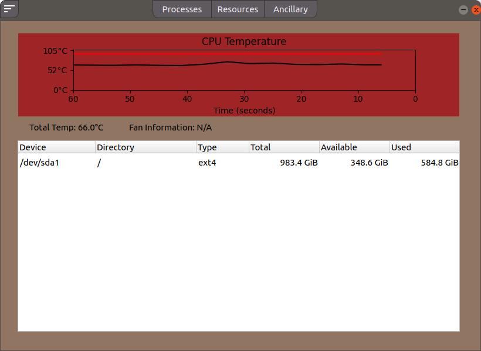
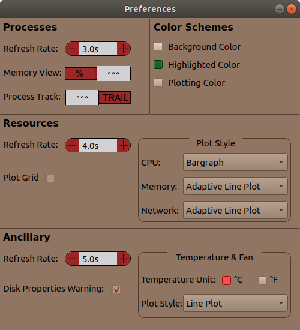

# Linux-Based-System-Monitor
A GNOME system monitor clone (design) built in PyQt5 with some extra added features

This project is meant to add on to what the GNOME system monitor is already capable of. However, it is in no way related to the any GNOME project. This GUI application trys to hihglight many of the capabilities that are available in the psutil package and without it this project would have been of orders more difficult.

Highlights include:

All that found in the GNOME system monitor (process, network, and hardware infomation, graphs, and tables) \
Increased information in all fields (process, network, storage)\
Additional options for process commands (Scheduling, Resource limits, ...)\
Preference window with multiple options for tables and graphs (Table display options, graph types {line, histogram, adptive})\
Added track or stable process option when selected, and deselecting a process\
Temperature graph with critical temperature line (red)\
Unique color scheme (sorry at the moment not changeable)

This is still a beta version and if any bugs are found please report or request a commit. Thank you for your patronage DanKulik
